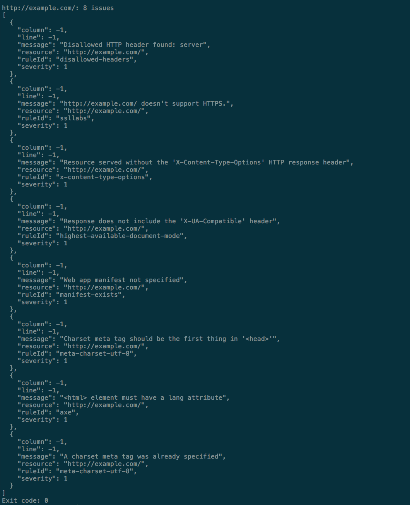

# Formatter json (`@hint/formatter-json`)

The `json` does a `JSON.stringify()` of the results. Output is not very user
friendly, but it can be useful when using it as input for other tools:



To use it you will have to install it via `npm`:

```bash
npm install @hint/formatter-json
```

Note: You can make `npm` install it as a `devDependency` using the `--save-dev`
parameter, or to install it globally, you can use the `-g` parameter. For
other options see
[`npm`'s documentation](https://docs.npmjs.com/cli/install).

And then activate it via the [`.hintrc`][hintrc]
configuration file:

```json
{
    "connector": {...},
    "formatters": "json",
    "hints": {
        ...
    },
    ...
}
```

<!-- Link labels: -->

[hintrc]: https://webhint.io/docs/user-guide/further-configuration/hintrc-formats/
